# Train Together Blog

Train together blog is blog where you as a user can find good inspiration for your training lifestyle. The app is targeted towards users who enjoy training insid the gym, as well as outside in nature. This blog is perfect for users that want save time with planing their training sessions.

This site acts as a repository for training sessions where user can store their own sessions as well as other users sessions.

The live link can be found here -[Train Together Blog](https://train-together-4d4fa50e508e.herokuapp.com/)
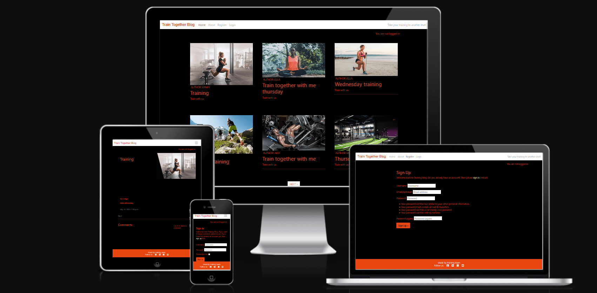

# Table of Contents
- [Train Together Blog](#train-together-blog)
- [User Experience (UX)](#user-experience-ux)
- [User Stories](#user-stories)
    + [EPIC Post List](#design)
    + [EPIC About](#about)
    + [EPIC Sign In](#sign-in)
    + [EPIC Comment](#comment)
    + [EPIC Editing comments](#edditing-comments)
    + [EPIC Adding pictures](#adding-pictures)
- [Design and colour scheme](#design-and-colour-scheme)
- [Imagery](#imagery)
- [Wireframes](#wireframes)
- [ Agile Methodology](#agile-Methodology)
- [Testing](#testing)
    + User Story Testing
    + Validator testing

- [Features](#features)
    + [Navigation Bar](#navigation-bar)
    + [Footer](#footer)
    + [Home Page](#home-page)
    + [About](#about)
- [User account pages](#user-account-pages)
    + [Sign Up](#sign-up)
    + [Log In](#log-in)
    + [Log Out](#log-out)
- [Deployment - Heroku](#deployment-heroku)
    + [Create the Heroku App](#create-the-heroku-app)
    + [Attach the Postgres database](#attach-the-postgres-database)
    + [Prepare the environment and settings.py file](#prepare-the-environment-and-settings.py-file)
    + [Create files/directories](#create-files/directories)
    + [Update Heroku Config Vars](#uppdate-heroku-config-vars)
    + [Deploy](#deploy)
- [Languages](#languages)
- [Frameworks - Libraries - Programs Used](#frameworks-libraries-programs-used)
- [Acknowledgments](#acknowledgments)

## User Experience (UX)
A visitor to Train Together Blog would be someone who is most likely an adult who enjoy training inside and outside  and someone who want to save a time and effort planing too much infront of every training session.
### User Stories
#### EPIC | Post List
1. As a user i want to se list of posts.
2. Give a site more than one post at the time and a list is seen when a user opens a site.
#### EPIC | About
1. As a site user I want to read about this blog.
#### EPIC | Sign In 
1. As a site user i want to be able to sing in to this blog.
2. As a returning user i want to be able to log in to this blog.
#### EPIC | Comment
1. As a user i want to be able to leave comment on a post.
#### EPIC | Edditing comments
1. Loged-in user can modify comments
2. Logged-in user can delete their comments
#### EPIC | Adding pictures
As a user I want to have picture about specific post in a blog.

### Design and colours scheme
The website has mix of dark, white and red colours. Those colours and dsign of the website were chosen in order to keep in theme with the site goals and to increase motivations level.

#### Imagery
All of the images at the website are designed by different authors to make sure that users have a choice between a gym training and outside in nature training.

#### Wireframes

 
Landing Page

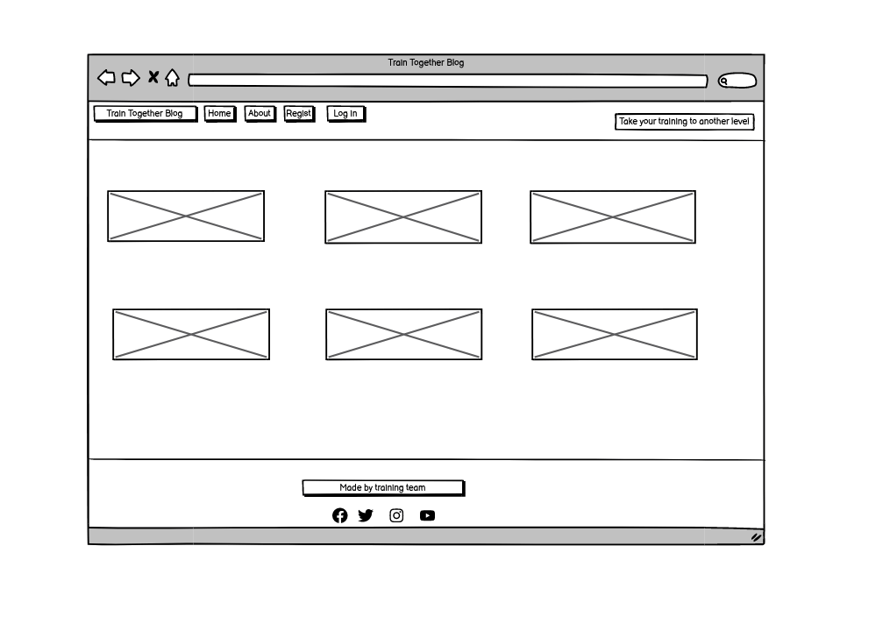

 

 ## Agile Methodology
 GitHub projects was used to manage development process using agile approach. GitHub issues were created for every User Story and every User Story has defined acceptance criteria to make sure UserStory has been compleated.

## Testing
### User stories testing
* This section outlines the testing process for the application, covering user story testing, validation testing, manual testing, and browser/device testing. The purpose of these tests is to ensure that all functionalities work as expected and that the user experience remains smooth across different platforms.

### EPIC User Profile
* As a site user, I want to register an account so that I can create and manage training content, as well as comment on other users' programs.
One of the key features of the platform is user authentication, enabling personalized interaction and content creation. The registration process is designed to be simple and intuitive, guiding new users through an easy sign-up process.

A clear and visible "Sign Up" button is prominently placed on the landing page, serving as a call to action for new users.
Clicking the button redirects users to the registration page, where they can create an account by providing their username, email, and password.
Users who already have an account can instead click the "Login" button, conveniently located next to the "Sign Up" button, directing them to the login page.
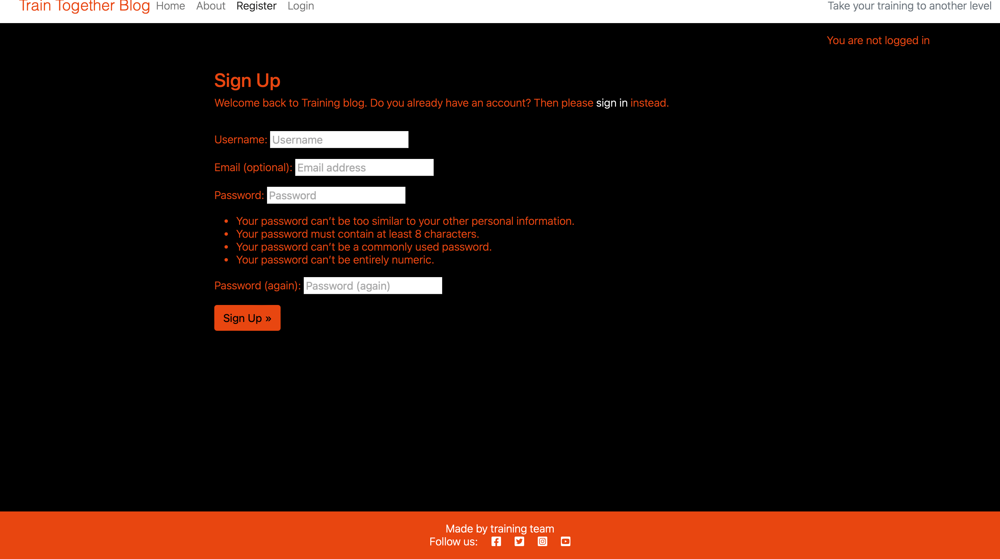 
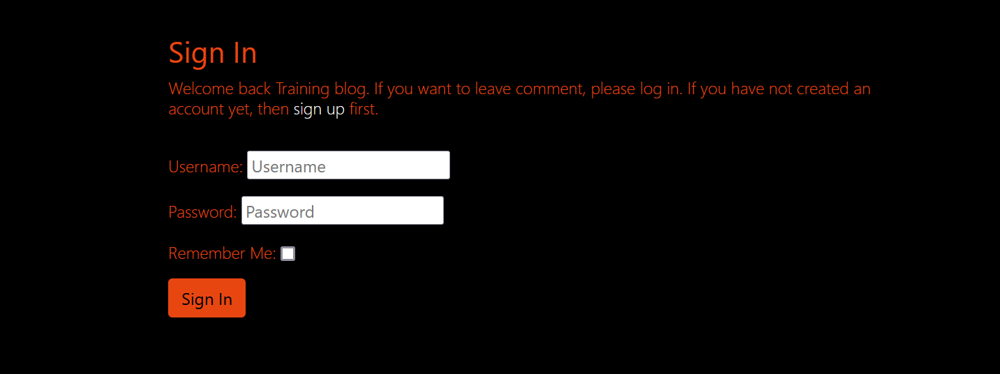

- As a user, I want to see a list of posts so that I can browse multiple pieces of training content at once.
Upon accessing the site, users are immediately presented with a dynamic and engaging list of posts. This ensures that users can:

Quickly browse through multiple training programs without needing to navigate away from the homepage.
Discover new workouts, techniques, or fitness insights shared by other users.
Engage with varied content, including text descriptions, images, and user-generated comments.
The post list is structured to be visually appealing and easily accessible, ensuring that users can effortlessly explore training content.
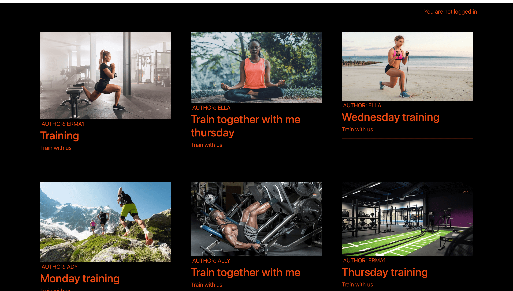

- As a site user, I want to read about the purpose of this blog so that I can understand its goals and features.
A dedicated "About" section provides users with essential information regarding the platform’s purpose, mission, and intended audience. This section ensures that users can:

Understand the platform’s vision—whether it’s a community-driven space for training discussions or a resource hub for fitness enthusiasts.
Gain insights into how they can contribute, whether by posting their own workouts, commenting on others, or engaging with the community.
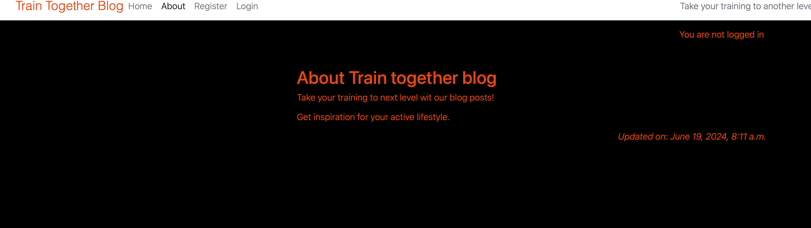

- As a user, I want to see images associated with specific posts so that I can visualize the training content.
A picture is worth a thousand words—especially in the fitness world! The platform allows users to include images in their posts, enhancing engagement and clarity. This feature ensures that users can:

See real examples of workouts, equipment, or exercise demonstrations.
Gain a better understanding of training techniques by viewing accompanying visuals.
Enjoy a more immersive experience with visually rich content.

## Validator Testing

### HTML
- During testing for every html section, there is some errors presented in the pictures bellow. Errors that appears doesn't affect negatively functionality of the project.
- ABOUT.HTML 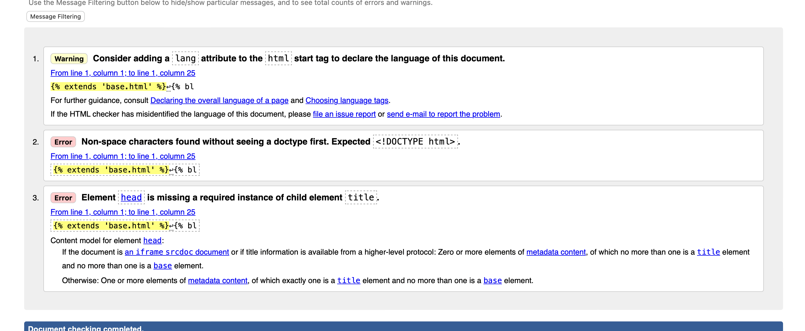
- INDEX.HTML 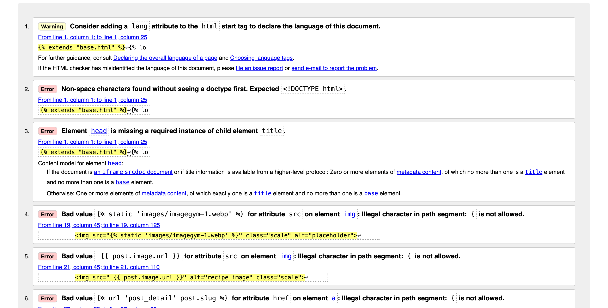
- POST_DETAIL.HTML 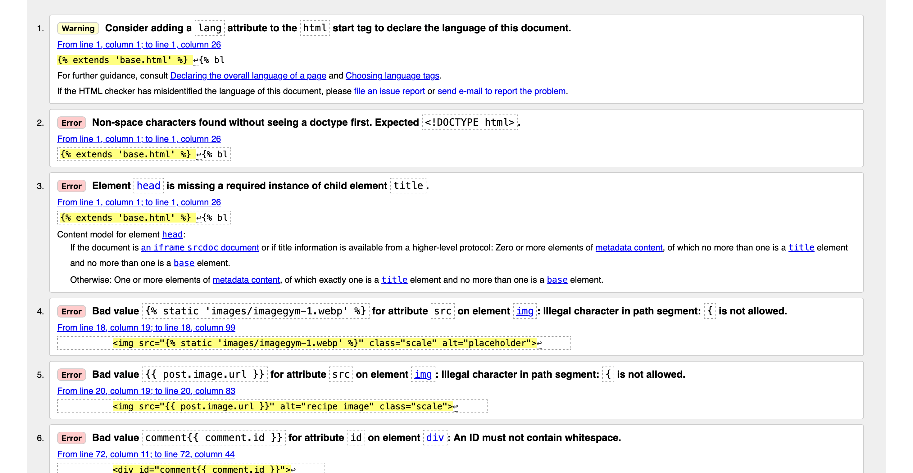
- BASE.HTML 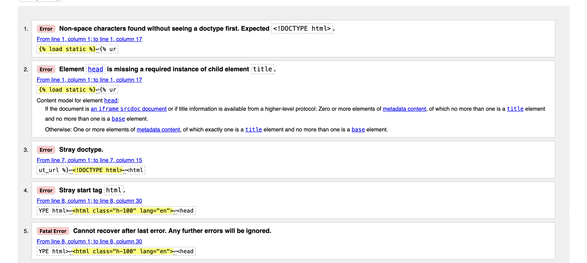
- LOGIN.HTML 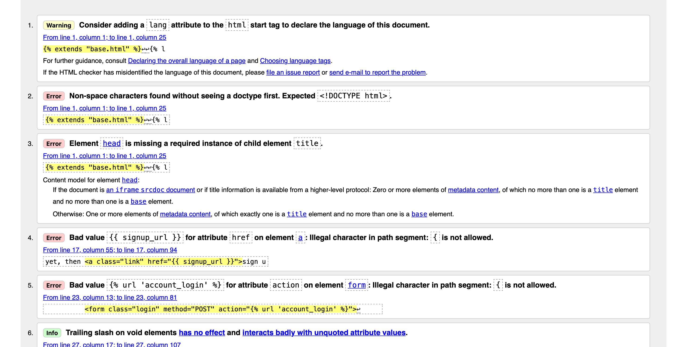
- LOGOUT.HTML 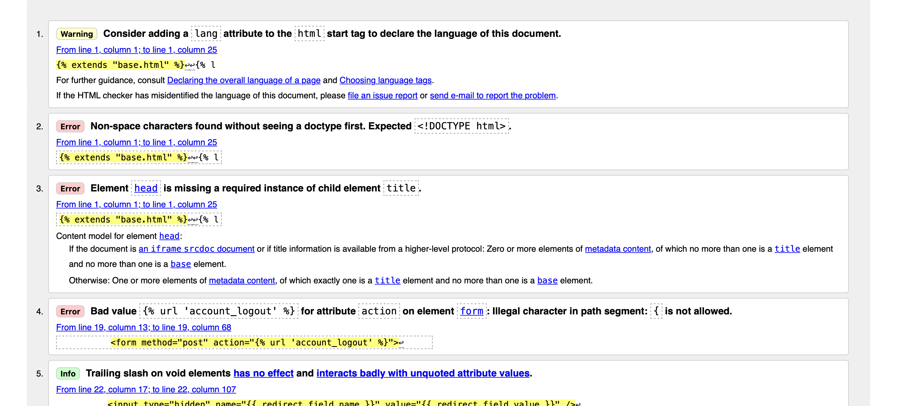
- SIGNUP.HTML 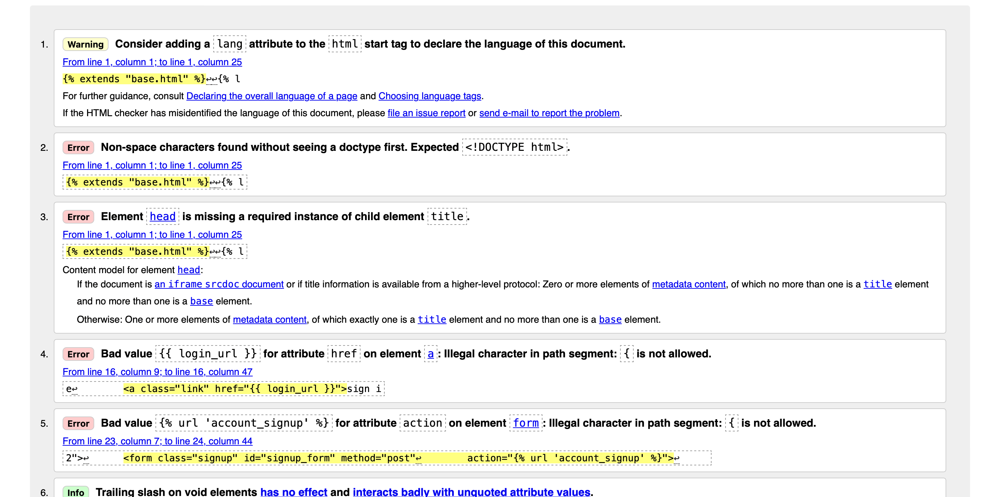 

- Testing and results can be found here:
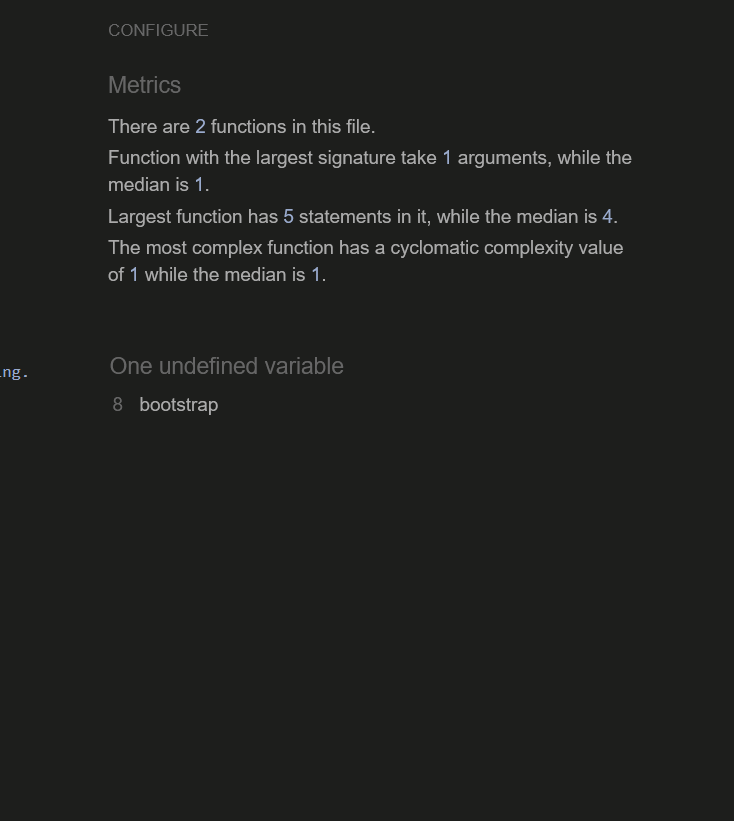
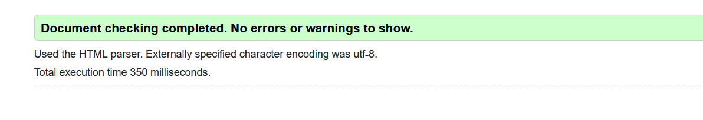
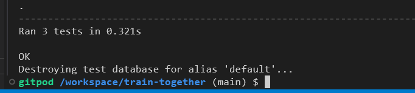
- Every python file was manually tested with no errors found.
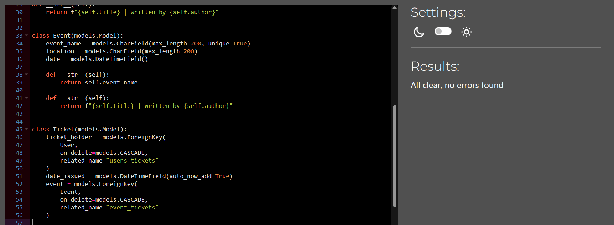

## Manual Testing
### Site Navigation

| Element               | Action     | Expected Result                                                    | Pass/Fail |
|-----------------------|------------|--------------------------------------------------------------------|-----------|
| NavBar                |            |                                                                    |           |
| Home Link             | Click      |Redirects the user to the homepage. The page loads correctly.       | Pass      |
| About Link            | Click      |Redirects the user to the About section, displaying relevant information.                                                                                              | Pass      |
| Register Link         | Click      |    Opens the registration page where users can create an account.                                             | Pass      |
| Register Link         | Display    |Only visible when the user is not logged in.                              | Pass      |
| Login Link            | Click      |Opens the login page where users can sign in.                                                 | Pass      |
| Logout Link           | Click      |Logs the user out and redirects them to the homepage.                                                 | Pass      |
| Logout Link           | Display    |Only visible when the user is logged in.                              | Pass      |
| Main section(post)    | Click      |Opens the selected post, showing full content and user comments.                                             | Pass      |
| User Login            | Click      |Opens the login page.                                                 | Pass      |

| Mobile View           |            |                                                                    |           |
| Home Link             | Click      |Redirects to the homepage, ensuring full mobile responsiveness.                                                 | Pass      |
| Browse Training Programs Link  | Click      |Opens the training program list page, correctly formatted for mobile.                                         | Pass      |
| Sign Up Link          | Click      |Opens the sign-up page.                                                 | Pass      |
| Sign Up Link          | Display    |Not visible if the user is already logged in.                                    | Pass      |
| Log In Link           | Click      |Opens the login page.                                                  | Pass      |
| Log In Link           | Display    |Not visible if the user is already logged in.                                     | Pass      |
| Logout Link           | Click      |Opens a logout confirmation page before logging out the user.                                         | Pass      |
| Logout Link           | Display    |Only visible if the user is logged in.                                  | Pass      |
| Footer(all links)     | Visible    |All links are visible and functional on mobile devices.                                   | Pass      |

### Training detail page

| Element               | Action     | Expected Result                                                    | Pass/Fail |
|-----------------------|------------|--------------------------------------------------------------------|-----------|
| Post 1                | Click      | Views post                                                         | Pass      |
| Post 2                | Click      | Views post                                                         | Pass      |
| Post 3                | Click      | Views post                                                         | Pass      |
| Post 4                | Click      | Views post                                                         | Pass      |
| Post 5                | Click      | Views post                                                         | Pass      |
| Post 6                | Click      | Views post                                                         | Pass      |
| Post 7                | Click      | Views post                                                         | Pass      |
| Post 8                | Click      | Views post                                                         | Pass      |
| Post 9                | Click      | Views post                                                         | Pass      |
| Post 10               | Click      | Views post                                                         | Pass      |
| User comment          | Display    | Displays correct name,date,time and comment body                                                        | Pass      |
| User comment          | Display    | Comments are ordered oldest to newest                                                         | Pass      |
| Edit comment button   | Display    | Button only visible if user is the comment author                                                           | Pass      |
| Leave a comment button| Click      | Views comment box                                                         | Pass      |
| Delete comment        | Click      | Opens delete comment tab                                                         | Pass      |
| Submit button                      | Click      | Submitting a comment                                                         | Pass      |
         
### Django All Auth Pages        

| Element               | Action     | Expected Result                                                    | Pass/Fail |
|-----------------------|------------|--------------------------------------------------------------------|-----------|
| Sign Up               |            |                                                                    |           |
| Log in link           | Click      | Redirect to login page                                             | Pass      |
| Username field        | Leave empty| On submit: form won't submit                                       | Pass      |
| Username field        | Leave empty| Fill this field appears                                            | Pass      |
| Username field        | Insert correct format| On submit: form submit                                   | Pass      |
| Email field           | Insert incorrect format| On submit: form won't submit                           | Pass      |
| Email field           | Insert incorrect format| Fill this field appears                                | Pass      |
| Email field           | Insert correct format  | On submit: form submit                                 | Pass      |
| Password field        | Insert incorrect format| On submit: form won't submit                           | Pass      |
| Password field        | Insert incorrect format| Fill this field appears                                | Pass      |
| Password field        | Passwords don't match  | On submit: form won't submit                           | Pass      |
| Password field        | Passwords don't match  | Error message displays                                 | Pass      |
| Password field        | Insert correct format and passwords match | On submit: form submit              | Pass      |
| Sign Up button        | Click                                     | Form submit                         | Pass      |
| Sign Up button        | Click                                     | Redirect to signup page             | Pass      |

| Login in              |                                           |                                     |           |
| Sign up link          | Click                                     | Redirect to sign up page            | Pass      |
| Username field        | Leave empty                               | On submit: form won't submit        | Pass      |
| Username field        | Leave empty                               | Fill this part appears              | Pass      |
| Username field        | Insert wrong username                     | On submit: form won't submit        | Pass      |
| Password field        | Leave empty                               | On submit: form won't submit        | Pass      |
| Password field        | Leave empty                               | Fill this part appears              | Pass      |
| Password field        | Insert wrong password                     | On submit: form won't submit        | Pass      |
| Password field        | Insert wrong password                     | Error message displays              | Pass      |
| Login button          | Click                                     | Form submit                         | Pass      |
| Login button          | Click                                     | Redirect to home page               | Pass      |
| Login button          | Click                                     | Success message confirming login appears| Pass      |

| Log out               |                                           |                                     |           |
| Logout button         | Click                                     | Redirect to homepage                | Pass      |
| Logout button         | Click                                     | Success message confirming log out appears| Pass      |

## Browser Testing
- The Website was tested on Google Chrome, Firefox, Safari browsers with no issues noted.

## Device Testing
- The website was viewed on three devices and it's presented in a pictures below. Responsive desing is used to test this part.
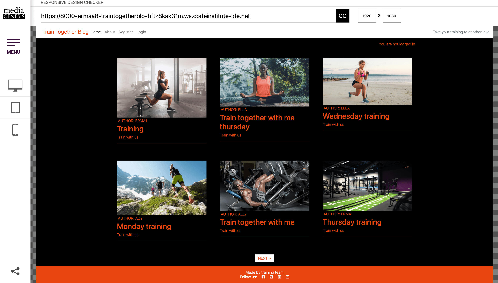
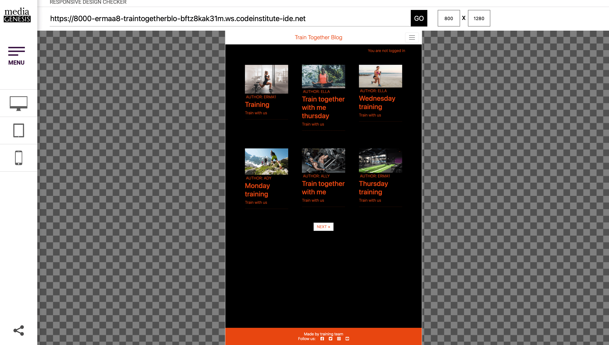
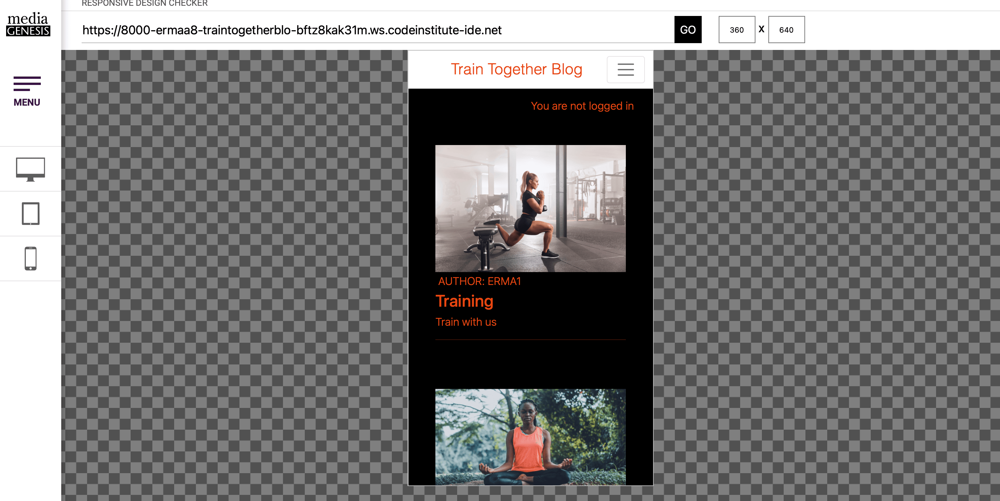

## ERD-diagram
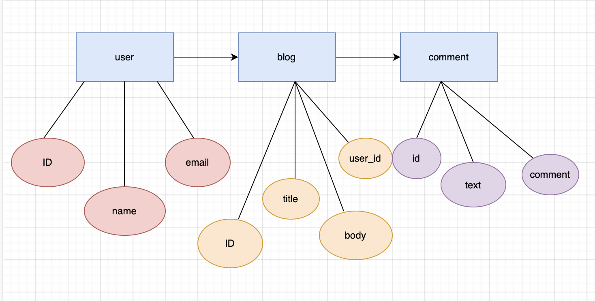

## Bugs 
### Fixed Bugs

- ### Django Packages
    - After following a walkthrought project many django packages were installed, but for some reason not every package worked in this project. However after some research and talking to tutors and getting right version, the riggt version of packages were installed into project. 

### User Authentication
- Django's LoginRequiredMixin is used to make sure that users that are non-authenticated do not have acces to secure pages.

## Features
**Navigation Bar**
- The navigation bar is present at the top of every page and includes links, as well as name of the site and a slogan.
- When a user is logged in, menu changed to , Home, About, Logout. 
/Navbar.png)

### Footer
- The footer section includes links to Facebook, Instagram, Twitter and Youtube.
/Footer.png)

### Home Page
- Home page includes every post for this website. There is variation between gym training and outside in nature training so that every user can find something for themselves. In this section there is possibility to leave, uppdate and edit a comment as well as a delete a comment.
/Homepage.png)

**About**
- About section includes information about this blog.
/About.png)

### User Account Pages
**Sign Up**

**Sign In**

**Sign Out**
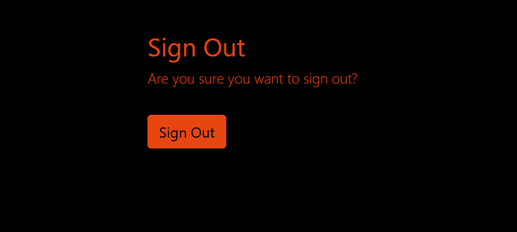

## Deployment - Heroku
- To deploy this page to Heroku from its GitHub repository, the following steps were taken:

### Create the Heroku App:
- Log in to Heroku and create account.
- On the main page click the button labelled New in the top right corner and from the drop-down menu select "Create New App".
- Enter a unique and meaningful app name.
- Select your region and click create app.

### Attach the Postgres database:
- In the Resources tab, under add-ons, type in Postgres and select the Heroku Postgres option.
- Copy the DATABASE_URL located in Config Vars in the Settings Tab.

### Prepare the environment and settings.py file:
- In your GitPod workspace, create env.py file.
- Add the DATABASE_URL value and  SECRET_KEY t env.py file.
- Update the settings.py file to import the env.py file and add the SECRETKEY and DATABASE_URL file paths.
- Comment out  the default database configuration.
- Save file than make migrations as usual.
- Add Cloudinary URL to env.py.
- Add the cloudinary libraries to the list of installed apps.
Add the STATIC files settings - the url, storage path, directory path, root path, media url and default file storage path.
- Link the file to the templates directory in Heroku.
- Change the templates directory to TEMPLATES_DIR
- Add Heroku to the ALLOWED_HOSTS list the format ['app_name.heroku.com', 'localhost']

### Create files / directories
- Create requirements.txt file.
- Create three directories in the main directory; media, storage and templates.
- Create a file named "Procfile" in the main directory and add the following: web: gunicorn project-name.wsgi

### Update Heroku Config Vars
Add theese Config Vars in Heroku.
- SECRET_KEY value (choose value)
- CLOUDINARY_URL
- PORT = 8000
- DISABLE_COLLECTSTATIC = 1

### Deploy
- For every deployment DEBUG= False in settings.py.
- On deploy tab on Heroku connect your project to Heroku.
- Scroll down and deploy page manually.
- Click view.

## Languages
- Python
- HTML
- CSS
- Javascript

## Frameworks - Libraries - Programs Used
- [Django](https://www.djangoproject.com/)
- [PostgreSQL](https://www.postgresql.org/)
- [Heroku](https://dashboard.heroku.com/apps)
- [Balsamiq](https://balsamiq.com/)
- [GitHub](https://github.com/)
- [Google-fonts](https://fonts.google.com/)
- [W3C](https://jigsaw.w3.org/css-validator/)
- [PEP8](https://pep8ci.herokuapp.com/)
- [Favicon](https://favicon.io/)
- [Cloudinary](https://cloudinary.com/)
- [Bootstrap-4.6](https://getbootstrap.com/docs/4.6/getting-started/introduction/)
- [I-am-responsive](https://ui.dev/amiresponsive)
- [Tinypng](https://tinypng.com/)
- [Responsivedesignchecker](https://responsivedesignchecker.com/#home)

## Acknowledgments
Thanks to my mentor Antonio for his support and advice. Thanks to 
The Code Institute slack community for their quick responses and very helpful feedback.

